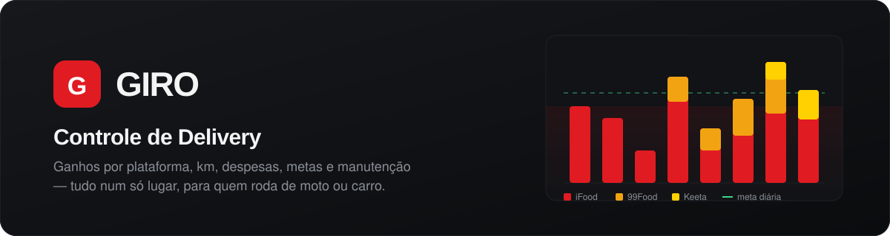
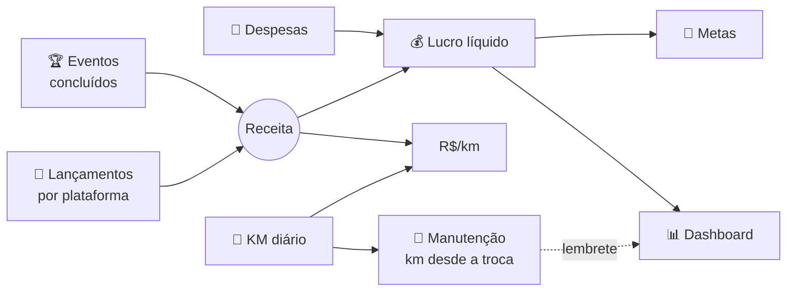

<p align="center">
  
</p>

<p align="center">
  
  
  
  
</p>

<p align="center">
  <b>Sistema pessoal para entregadores que rodam em várias plataformas.</b><br>
  Lance o dia de cada app, registre o odômetro e as despesas, e veja quanto sobrou de verdade:<br>
  lucro líquido, R$/km, metas, bônus de eventos e a próxima troca de óleo.
</p>

<p align="center">
  <a href="#-funcionalidades">Funcionalidades</a> ·
  <a href="#-instalação">Instalação</a> ·
  <a href="#-adicionando-uma-plataforma">Nova plataforma</a> ·
  <a href="#-regras-de-cálculo">Regras de cálculo</a> ·
  <a href="#-segurança">Segurança</a>
</p>

---

## ✨ Funcionalidades

<table>
  <tr>
    <td width="50%" valign="top">
      <h3>📊 Dashboard</h3>
      Foto do mês corrente: lucro líquido, receita por plataforma, ganho por km,
      média por dia, comparação com a semana passada e gráfico de ganhos por dia
      com a linha da meta.
    </td>
    <td width="50%" valign="top">
      <h3>🛵 Lançamento por plataforma</h3>
      iFood, 99Food e Keeta já vêm prontos, cada um com os campos que o app
      realmente mostra. Novas empresas entram <b>só com SQL</b>, sem tocar no código.
    </td>
  </tr>
  <tr>
    <td valign="top">
      <h3>📍 KM diário</h3>
      Odômetro inicial e final do dia. O km inicial já vem preenchido com o
      último km final, e o R$/km de cada dia é calculado sozinho.
    </td>
    <td valign="top">
      <h3>💸 Despesas</h3>
      Combustível, manutenção, plano de celular, seguro… por categoria, com
      totais e participação de cada uma no mês.
    </td>
  </tr>
  <tr>
    <td valign="top">
      <h3>📅 Resumo mensal</h3>
      Fechamento mês a mês: receita por plataforma, bônus de eventos,
      despesas, lucro líquido, km rodados e R$/km.
    </td>
    <td valign="top">
      <h3>🎯 Metas</h3>
      Meta diária e mensal, dias que bateram a meta e quanto falta por dia
      para fechar o mês no alvo.
    </td>
  </tr>
  <tr>
    <td valign="top">
      <h3>🏆 Eventos</h3>
      Desafios das plataformas com recompensa, como <i>"60 entregas em 15 dias
      = R$ 3.000"</i>. Ao concluir, o bônus entra no resumo do mês.
    </td>
    <td valign="top">
      <h3>🔧 Manutenção</h3>
      Pneu a cada 20.000 km, óleo a cada 1.000 km… A contagem usa o odômetro do
      KM diário e avisa no dashboard quando a troca está chegando.
    </td>
  </tr>
</table>

> 🌗 Tema escuro e claro, layout responsivo para usar no celular entre uma entrega e outra.

---

## 🚀 Instalação

**Requisitos:** PHP 8.1+ com `pdo_mysql` e `session` (`mbstring` recomendada) e
MySQL 5.7+ ou MariaDB 10.2+ (o schema usa colunas geradas). Funciona em
hospedagem compartilhada comum, sem Composer nem `mod_rewrite`.

```bash
git clone https://github.com/lucianofurtado/delivery.git
cd delivery
cp config/config.example.php config/config.php
```

1. **Configure o banco** em `config/config.php`:

   ```php
   'db' => [
       'host'    => 'localhost',
       'nome'    => 'seu_banco',
       'usuario' => 'seu_usuario',
       'senha'   => 'sua_senha',
   ],
   ```

2. **Abra `setup.php` no navegador.** Ele cria as tabelas e cadastra seu
   usuário e senha. Se quiser, marque a opção de carregar dados de exemplo.
3. **Apague o `setup.php`** do servidor.
4. Entre por `login.php`. 🎉

<details>
<summary><b>Prefere o terminal?</b></summary>

```bash
mysql -u seu_usuario -p seu_banco < sql/schema.sql
mysql -u seu_usuario -p seu_banco < sql/seed_demo.sql   # opcional
```

O usuário de login ainda precisa ser criado pelo `setup.php`, que grava a
senha com o hash correto.
</details>

### 🗄️ Banco de dados

Todo o banco está em **um único arquivo**, [`sql/schema.sql`](sql/schema.sql):
tabelas, plataformas, campos de cada uma, categorias de despesa, eventos,
manutenção e metas padrão. Ele usa `CREATE TABLE IF NOT EXISTS` e
`ON DUPLICATE KEY UPDATE`, então rodar de novo num banco existente **só cria o
que falta**, sem apagar dados.

---

## 🧭 Como funciona



---

## ➕ Adicionando uma plataforma

Empresas **e os campos de cada uma** são dados, não código. Exemplo com a Rappi:

```sql
-- 1. A empresa
INSERT INTO plataformas (slug, nome, cor, ordem) VALUES ('rappi', 'Rappi', '#FF3008', 4);

-- 2. Os campos do formulário dela
INSERT INTO plataforma_campos (plataforma_id, coluna, rotulo, ordem)
SELECT p.id, c.coluna, c.rotulo, c.ordem
FROM plataformas p
JOIN (
  SELECT 'valor_base' AS coluna, 'Valor da corrida' AS rotulo, 1 AS ordem UNION ALL
  SELECT 'promos',      'Bônus',   2 UNION ALL
  SELECT 'gorjetas',    'Gorjeta', 3
) c
WHERE p.slug = 'rappi';
```

Pronto: ela aparece no menu, no dashboard, no gráfico e no resumo mensal.

<details>
<summary><b>Como funcionam os campos</b></summary>

`plataforma_campos.coluna` diz em qual slot da tabela `lancamentos` o campo grava:

| Slot | Tipo | Soma no total do dia? |
|---|---|:---:|
| `valor_base`, `promos`, `gorjetas`, `adicional`, `outros` | dinheiro | ✅ |
| `rotas`, `solicitacoes` | contador | — |

- `rotulo` é o nome exibido na tela; use o termo que a empresa usa.
- `ordem` define a ordem das colunas no formulário e na tabela.
- Com o campo `solicitacoes`, a última coluna da tabela vira **Ganho por solicitação**; sem ele, **R$/km**.
- Tirar um campo sem perder histórico: `UPDATE plataforma_campos SET ativo = 0 WHERE ...`
- Desativar uma empresa: `UPDATE plataformas SET ativo = 0 WHERE slug = '...'`

**Campos que já vêm configurados:**

| iFood | 99Food | Keeta |
|---|---|---|
| Rotas *(contador)* | Valor do pedido | Taxa de entrega |
| Rotas completas | Recompensa | Recompensas e extras |
| Promos | Gorjeta | Gorjetas |
| Gorjetas | Compensação | Outros |
| Adicional super | Outro | Pedidos *(contador)* |
| Outros | Solicitações *(contador)* | |

Categorias de despesa funcionam do mesmo jeito, na tabela `categorias_despesa`.
</details>

---

## 🧮 Regras de cálculo

| | Regra |
|---|---|
| **Lançamento** | Um por plataforma por dia. Salvar a mesma data substitui o dia. |
| **Total do dia** | Soma dos campos de dinheiro da plataforma (coluna gerada no banco). |
| **Km rodados** | Km final − km inicial, nunca negativo. |
| **Lucro** | Receita − despesas. Despesas em dias sem receita também contam no mês. |
| **R$/km** | Receita das corridas ÷ km rodados. |
| **Dashboard e metas** | Sempre o mês corrente do calendário, não o mês do último lançamento. |
| **Falta por dia** | (meta mensal − lucro do mês) ÷ dias restantes, contando hoje. |
| **Eventos** | O bônus de um evento concluído entra na receita e no lucro do mês em que ele termina. R$/km e média por dia continuam olhando só as corridas. |
| **Manutenção** | Km desde a troca = último km final do KM diário − km da última troca. Fica 🟡 *trocar em breve* dentro da antecedência configurada e 🔴 *trocar agora* ao passar do intervalo. |

---

## 🗂️ Estrutura

```
├── index.php            front controller: ações (POST) e telas (GET)
├── login.php · logout.php
├── setup.php            instalador — apague depois de usar
├── app/
│   ├── bootstrap.php    carrega tudo, sessão e render()
│   ├── helpers.php      formatação pt-BR, CSRF, flash, url
│   ├── db.php           conexão PDO e atalhos q() / q1() / exec_sql()
│   ├── auth.php         login, proteção de rota, freio de força bruta
│   └── repo.php         acesso ao banco e cálculo das métricas
├── views/               uma tela por arquivo + layout.php
├── assets/              app.css, app.js e ícones
├── config/              config.example.php → copie para config.php
└── sql/
    ├── schema.sql       banco completo
    └── seed_demo.sql    dados de exemplo (opcional)
```

---

## 🔒 Segurança

- 🔑 Senha com `password_hash()` (bcrypt) e re-hash automático
- 🛡️ Prepared statements em todas as consultas
- 🎟️ Token CSRF em todo formulário
- 🍪 Cookie de sessão `HttpOnly`, `SameSite=Lax` e `Secure` sob HTTPS
- ⏱️ Bloqueio de 10 minutos após 5 tentativas de login erradas
- 🚫 `.htaccess` bloqueia acesso direto a `app/`, `config/`, `sql/`, `views/` e a arquivos `.sql` / `.md`
- 🙈 `config/config.php` fica fora do Git; nunca versione a senha do banco

> [!IMPORTANT]
> Em produção, mantenha `'debug' => false` e apague o `setup.php` depois da instalação.

---

<p align="center">
  Feito para quem vive no <b>giro</b> 🛵💨
</p>
